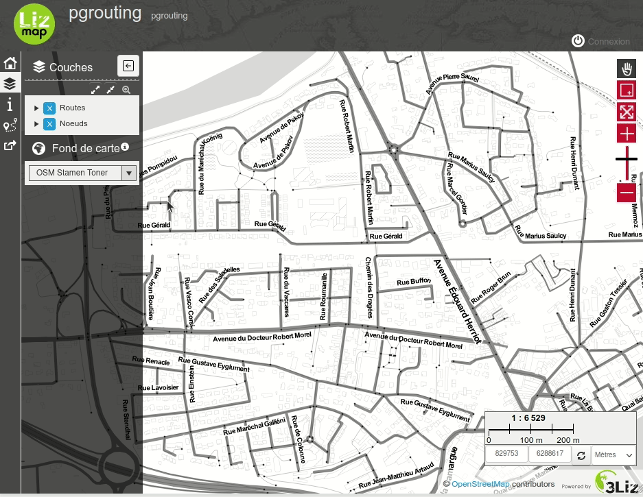

# Lizmap PgRouting Module

* Lizmap 3.5.6 minimum
* Documentation (installation, usage..) : https://docs.3liz.org/lizmap-pgrouting-module or see the docs/ directory
* Funded by [CRIGE PACA](https://www.crige-paca.org/) in France

## Getting help

* Send an email the Lizmap mailing list at https://lists.osgeo.org/pipermail/lizmap/
* Join us on IRC, #lizmap on https://libera.chat
* Open a GitHub tickets on https://github.com/3liz/lizmap-pgrouting-module/issues
* Commercial support through 3Liz , [contact us](mailto:info@3liz.com?subject=CommercialSupportRequest)
