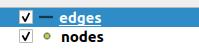

# Configuration

## Data integration

Once the module is installed, you have to fill the tables with your data.

Here is an example based on the French IGN BDTopo route layer loaded in `myschema.bdtopo`.
In this query the function `pgrouting.create_edge` is used. It allows to create edges and 
creating the nodes at the start and end of the edge. This function required some parameters
like:

* **geom**, it's the geometry retrieved from your layer
* **cost**, currently calculated according to the direction of travel of the road
* **reverse_cost**, currently calculated according to the direction of travel of the road

The edges table contains all road with some field required for pgrouting.
Depending on your source layer, you might not have the same field names. Here, `bd.geom` is 
the geometry field, `bd.sens` is the direction field, `bd.nom_1_g` is the road name filed.
For these fields, `bd` is the alias of the table, so you only need to modify the part after 
the point.

```sql
INSERT INTO pgrouting.edges_info(id,label,length)
SELECT pgrouting.create_edge(
        ST_geometryN(bd.geom, 1),
        CASE WHEN bd.sens in ('Sans objet', 'Double sens', 'Sens direct') THEN
            ST_length(bd.geom)
        ELSE -1
        END,
        CASE WHEN bd.sens in ('Sans objet', 'Double sens', 'Sens inverse') THEN
            ST_length(bd.geom)
        ELSE -1
        END
    ), 
    bd.nom_1_g, 
    ST_length(bd.geom)
FROM myschema.bdtopo bd;
```

Here is an example based on point of interest layer loaded in `myschema.point_of_interest`.
This query refill the `pgrouting.routing_poi` table. In the select you can replace the fields by 
your fields on your point of interest layer.
```sql
INSERT INTO pgrouting.routing_poi(label, type, description, geom)
SELECT poi.label, poi.type, poi.description, poi.geom
FROM myschema.point_of_interest poi;
```

## In QGIS

### Configure QGIS project

To use the cadastre module in **Lizmap Web Client** you must first configure
a **QGIS project**:

We offer you [here](../tests/lizmap/instances/pgrouting) a basic project which contains
only the layers required and configured for Lizmap.

If you want create your project or use another existing project to use this module:

* Add the Edges and Nodes layers



* You must then create configuration for Lizmap with the Lizmap plugin. No specific 
  configuration was needed for the module. You can configure like you want or just click on
  apply button.
