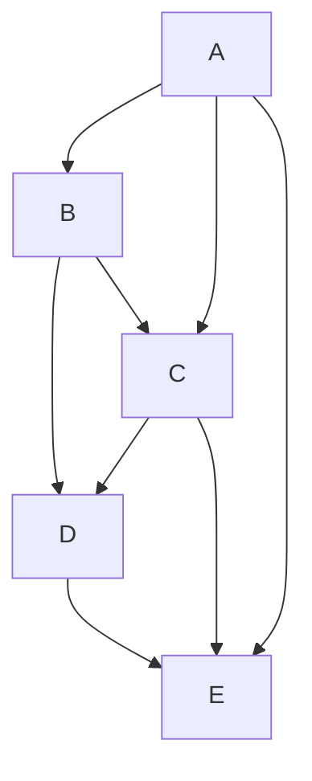

# Configuration

## Data integration

Once the module is installed, you have to fill the tables with your data, for example from a road table containing linestrings.

* `pgrouting.nodes`: nodes of the routing graph, for example the start and end nodes of the linestrings,
* `pgrouting.edges`: edges of the graph, which mean the links between the nodes, characterized by their source and target nodes,
* `pgrouring.routing_poi`: optional points of interests along the roads (point geometries)

We presented below an example of data import based on the French **IGN BDTopo** road layer loaded in a table `bdtopo.troncon_de_route`.

* The first step is to import the data to your PostgreSQL database. We recommend to use another schema, such as `bdtopo`.
* The second step is to add data in the pgrouting `nodes` and `edges` tables, taken from the source table.

### Import your source data in PostgreSQL

Your source data must be **topological**, which means roads must be cut at each physical intersection and do not overlap other roads.



You can use `ogr2ogr` to import your data in batch, for example with

```bash
ogr2ogr -progress --config PG_USE_COPY YES -f PostgreSQL PG:'service=lizmap-pgrouting active_schema=bdtopo' -lco DIM=2 -append -lco GEOMETRY_NAME=geom -lco FID=gid -nln bdtopo.troncon_de_route -t_srs EPSG:2154 -nlt PROMOTE_TO_MULTI "TRONCON_DE_ROUTE.shp"
```

In the example above, the `-append` option allows to import several SHP inside the same table if needed.
This command will add a `gid` column as the primary key.

Be careful to delete the duplicate geometries, for example when you import data from multiple
source files with overlapping data (such as in the French IGN BDTOPO "département" extracts).
You can use this kind of query to remove the duplicates based on the primary key `gid` and the IGN BDTOPO key `id`:

```sql
DELETE FROM bdtopo.troncon_de_route AS a USING bdtopo.troncon_de_route AS b WHERE a.gid < b.gid AND a.id = b.id;
```

### Import the road data into PgRouting graph (nodes and edges)

Depending on your source layer, you might not have the same field names. Here,

* `fid` is the unique ID,
* `geom` is the geometry field,
* `sens_de_circulation` is the field with the road direction,
* `nom_voie_ban_gauche` is the field containing the road name

We also decide to keep other interesting fields describing the edges :

* `nature`: the category of the road,
* `importance`: the road level of importance
* `etat_de_l_objet`: the road state,
* `largeur_de_chaussee`: the road width
* `prive`: if the road is private or public
* `vitesse_moyenne_vl`: the average speed for light vehicles
* `acces_vehicule_leger`: if the road can be accessed by light vehicles


??? "Display the SQL"
    ```sql
    BEGIN;
    
    -- Copy data from the route source table
    -- For example: bdtopo.troncon_de_route
    -- to create the temporary edges
    -- with added start and end point point geometries.
    DROP TABLE IF EXISTS temp_edges;
    CREATE TABLE temp_edges AS
    WITH source AS (
        SELECT
            -- Stores the original data inside a JSON field
            to_jsonb(t.*) AS raw_data,
            -- Move the geometries nodes to a grid
            ST_SnapToGrid(ST_geometryN(geom, 1), 0.1) AS geom
        -- bdtopo.troncon_de_route is the source road table
        FROM bdtopo.troncon_de_route AS t
        WHERE TRUE
    )
    SELECT
        source.*,
        -- get the start point
        ST_StartPoint(geom) AS start_point,
        -- get the end point
        ST_EndPoint(geom) AS end_point
    FROM source
    ;
    -- Create the needed indexes
    CREATE INDEX ON temp_edges USING GIST (geom);
    CREATE INDEX ON temp_edges USING GIST (start_point);
    CREATE INDEX ON temp_edges USING GIST (end_point);
    
    -- Create the temporary nodes from the start and end points
    DROP TABLE IF EXISTS temp_nodes;
    CREATE TABLE temp_nodes AS
    WITH
    union_start_end AS (
        SELECT raw_data->>'fid' AS start_of, NULL AS end_of, start_point AS geom
        FROM temp_edges
        UNION ALL
        SELECT NULL AS start_of, raw_data->>'fid' AS end_of, end_point AS geom
        FROM temp_edges
    ),
    distinct_nodes AS (
        SELECT
            json_agg(DISTINCT start_of) FILTER (WHERE start_of IS NOT NULL) AS start_of,
            json_agg(DISTINCT end_of) FILTER (WHERE end_of IS NOT NULL) AS end_of,
            geom
        FROM union_start_end
        GROUP BY geom
    )
    SELECT *
    FROM distinct_nodes
    ;
    CREATE INDEX ON temp_nodes USING GIST (geom);
    
    -- Insert them in the pgrouting.nodes table
    TRUNCATE pgrouting.nodes RESTART IDENTITY CASCADE;
    INSERT INTO pgrouting.nodes (geom)
    SELECT geom
    FROM temp_nodes
    ;
    
    -- Insert the temporary edges into the pgrouting.edges table
    -- with additional information about nodes, costs, etc.
    TRUNCATE pgrouting.edges RESTART IDENTITY CASCADE;
    INSERT INTO pgrouting.edges (label, length, source, target, cost, reverse_cost, source_data, geom)
    SELECT DISTINCT
        -- label of the edge
        e.raw_data->>'nom_voie_ban_gauche' AS label,
        -- length
        ST_length(e.geom) AS "length",
        -- start and end nodes id
        ns.id, ne.id,
        -- cost based on the length
        CASE
            WHEN e.raw_data->>'sens_de_circulation' in ('Sans objet', 'Double sens', 'Sens direct')
                THEN ST_length(e.geom)
            ELSE -1
        END AS cost,
        -- reverse cost based on the length
        CASE
            WHEN e.raw_data->>'sens_de_circulation' in ('Sans objet', 'Double sens', 'Sens inverse')
                THEN ST_length(e.geom)
            ELSE -1
        END AS reverse_cost,
        -- Keep some useful columns from the source table
        jsonb_build_object(
            'fid', e.raw_data->'fid', 'nature', e.raw_data->'nature', 'importance', e.raw_data->'importance',
            'etat_de_l_objet', e.raw_data->'etat_de_l_objet', 'largeur_de_chaussee', e.raw_data->'largeur_de_chaussee', 'prive', e.raw_data->'prive',
            'sens_de_circulation', e.raw_data->'sens_de_circulation', 'vitesse_moyenne_vl', e.raw_data->'vitesse_moyenne_vl', 'acces_vehicule_leger', e.raw_data->'acces_vehicule_leger'
        ) AS source_data,
        -- geometry. Needed for the astar route engine
        e.geom
    FROM temp_edges AS e
    LEFT JOIN pgrouting.nodes AS ns
        -- = is faster than ST_Equals
        ON ns.geom = e.start_point
    LEFT JOIN pgrouting.nodes AS ne
        ON ne.geom = e.end_point
    ;
    
    -- Drop the temporary tables
    DROP TABLE IF EXISTS temp_nodes;
    DROP TABLE IF EXISTS temp_edges;
    
    COMMIT;
    
    -- VACUUM and analyse
    VACUUM ANALYSE pgrouting.nodes;
    VACUUM ANALYSE pgrouting.edges;
    
    ```

### Import data in the POI tables (optional)

Here is an example based on a "point of interest" layer loaded in a table called `your_schema.point_of_interest`.

This query fill the `pgrouting.routing_poi` table. In the `SELECT` you can replace the fields by
your fields of your point of interest layer.

```sql
INSERT INTO pgrouting.routing_poi (label, type, description, geom)
SELECT poi.label, poi.type, poi.description, poi.geom
FROM your_schema.point_of_interest AS poi;
```

## In QGIS

### Configure the QGIS project

To use the pgrouting module in **Lizmap Web Client** you must first configure
a **QGIS project**:

You can download [the PgRouting demo, in the "Modules" section](https://demo.lizmap.com/lizmap/) which contains a basic
project with only the layers required and configured for Lizmap.

If you want to **create your project** or use another existing project to use this module:

* Add the **edges** and **nodes** layers with these exact names. You can rename them in the plugin.
* The QGIS project must be called `pgrouting.qgs` or contain a QGIS **project variable**
  called `lizmap_pgrouting_enabled` with the value `yes`


* You must then create a **configuration** for Lizmap with the **Lizmap plugin**. No specific
  configuration is needed for the module. You can configure like you want or just click on the
  apply button.
